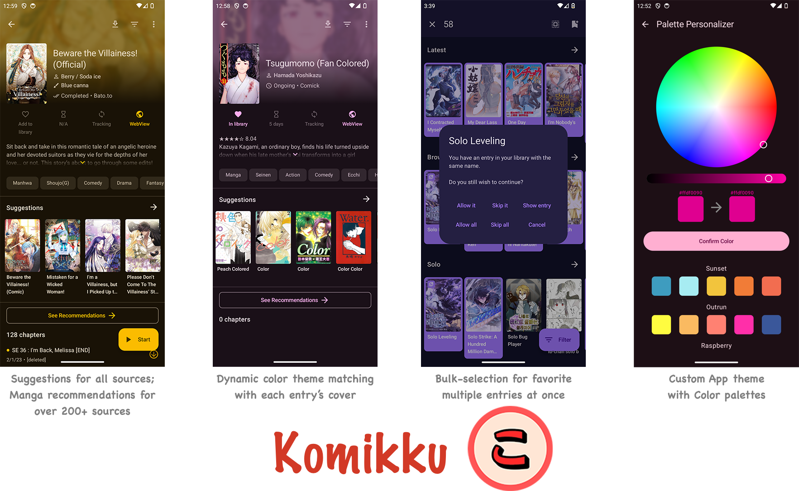

<div align="center">

<h1 align="center">ZYComic</h1>

<p>一款安卓在线漫画阅读器，内置 manwa 线路与图源。</p>

<p>
  
  
  
</p>

</div>

<!--
截图占位：后续把 ZYComic 自己的图标 / 截图放到 .github/readme-images/ 后，在此引用，例如：

（在提供正式素材前不引用任何图片，避免展示上游 komikku 的旧图。）
-->

---

## 简介

ZYComic 是一款 Android 在线漫画 App：

- **线路**：同一后端的多个可切换域名，内置延迟测速与故障切换，切换线路时同步登录态（Cookie）。
- **图源**：对接 manwa 后端的加密图片接口，由客户端解密后阅读。
- **阅读器**：复用成熟的 komikku（Tachiyomi / Mihon 系）阅读器内核，支持条漫（Webtoon 上下滚动）、左/右翻页、双页、双击/双指缩放、大图分块与丰富的阅读设置。
- **界面**：基于 Jetpack Compose + Material 3 自研主界面（浏览 / 书架 / 历史 / 搜索 / 我的 / 设置）。

## 功能特性

- 多线路手动 / 自动切换、延迟测速、故障自动转移
- 漫画浏览、搜索、排行、最新更新、分类标签
- 收藏与收藏夹、阅读历史（支持单条与多选删除）
- 内置图源，加密图片客户端解密阅读
- 强大阅读器：条漫 / 分页 / 双页、缩放、导航区自定义、阅读偏好
- 外观主题、标签屏蔽、数据与存储管理

## 运行环境

- Android 8.0（API 26）及以上
- 当前仅提供 `arm64-v8a`（覆盖主流真机）

## 下载与构建

- 正式版本计划通过 GitHub [Releases](https://github.com/fuoins/ZYComic-Android/releases) 发布（含签名 APK）；当前阶段产物默认**未签名**，安装分发前需自行签名。
- 本项目通过 **GitHub Actions** 构建，支持手动触发的「快速构建（quick）」与「完美构建（final）」两种模式，当前目标 ABI 为 `arm64-v8a`。
- 本地源码构建需 JDK 17、Android SDK Platform 36：

```bash
git clone --recursive https://github.com/fuoins/ZYComic-Android.git
cd ZYComic-Android
./gradlew assembleRelease
```

## 技术栈

Kotlin · Jetpack Compose · Material 3 · Voyager · Coil 3 · SQLDelight（SQLCipher）· OkHttp / Retrofit · Injekt。

## 开源许可与归属

ZYComic 的阅读器内核与 UI 框架基于开源项目 **komikku**（其又源自 TachiyomiSY 与 Mihon / Tachiyomi），相关代码遵循 **Apache License 2.0**。

- 本项目同样以 Apache License 2.0 开源，详见 [LICENSE](./LICENSE)。
- 已按许可要求保留上游版权声明与许可文件；本项目与 komikku / Tachiyomi / Mihon 无官方关联，亦不使用其商标。

## 仓库

- 源码仓库：<https://github.com/fuoins/ZYComic-Android>
- 作者：fuoins
